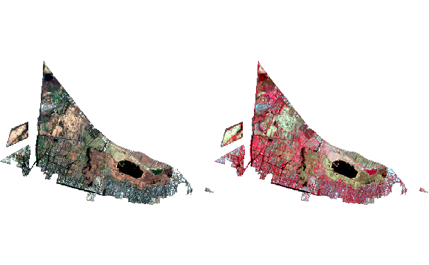
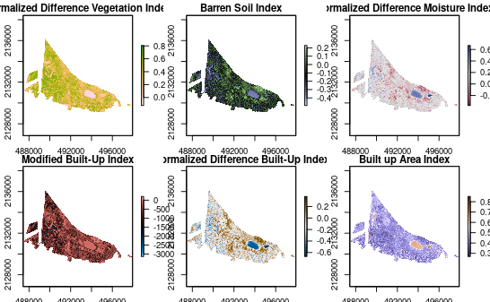

# Multitemporal Stacker

This is a demo of the code used to create and analyze multitemporal stacks of Sentinel 2A data and corresponding spectral index calculations. This code was published in [Advances in Geospatial Data Science](https://link.springer.com/conference/igisc) presented in the 2023  [IGISc](https://igisc.org/) under the title "Estimating land cover changes using multi-temporal spectral index raster stacks in protected national areas of Xochimilco". This code is open source, but please cite any use of the code. 

Waluyo, I., (2023). Estimating land cover changes using multi-temporal spectral index raster stacks in protected national areas of Xochimilco. Advances in Geospatial Data Science.

The scripts are divided in four parts:

1. 01_RASTER_STACK.R - Searches for all Sentinel2A data in a directory and creates stacks based on the sensing dates for each of the bandwidths included in Sentinel2A data. 
2. 02_INDEX_CALCULATION.R - Calculates vegetation indexes (ndvi, evi, avi, savi), Soil indexes (bsi), Water indexes (ndmi, ndwi) and Built environment indexes (baei, ui, ndbi, mbi).
3. 03_INDEX_MULTITEMPORAL_RASTER_DATA_EXPLORE.R - Creates data.frame of the raster data of each of the multitemporal stacks and visualizations to compare results.
4. 04_INDEX_MULTITEMPORAL_UNIVARIATE_PLOTS.R - Creates violin plots that compare the mean index values by month, year and season. 
5. 05_INDEX_MULTITEMPORAL_UNIVARIATE_STATISTICS.R - Creates tables that compare the mean index values by month, year and season.

## PART 0: Directory and data setup

### Directory setup

Before running the code, it is recommended to set up a project directory with 3 sub directories as follows, although, the code can be adjusted as the user prefers. 

- Directory 0: Project directory 
- Directory 1: Create a directory named 'RASTER' where user stores all downloaded Sentinel2A files. 
- Directory 2: Create a directory named 'SIG' where user stores shape files of the region of interest (ROI) that are used to clip the raster images
- Directory 3: Create a directory named 'RDATA' where the code will save RData files contaning objects of each step

The first lines of the first script set up these directories as follows:

```{r, eval = FALSE, echo = FALSE}
# DIRECTORY 0: PROJECT DIRECTORY
main_dir <- "CONTAINS R SCRIPTS AND DATA"

# DIRECTORY 1: RASTER DATA DIRECTORY
raster_dir <- "CONTAINS SENTINEL 2A RASTERS"

# DIRECTORY 2: GIS DATA DIRECTORY
sig_dir <- "CONTAINS REGION OF INTEREST VECTOR DATA"

# DIRECTORY TO STORE RESULTS
results_dir <- "CONTAINS SCRIPS RESULTS"
```

Directories can have different names, but be sure to adjust the code to read the files. 

### Data setup

Download and decompress Sentinel 2A data into the 'RASTER' directory. The demo uses 34 Sentinel 2A MSI level 1-C images downloaded from Copernicus Hub from orbit 69 between 2015 and 2023, with a maximum cloud coverage of 10%. 

Download demo raster data: [DEMO_RASTER DATA]()

Download demo GIS data: [DEMO GIS DATA](https://drive.google.com/file/d/1sDa7dLhdUKk3AytIihkT5dZwX6pB-ieY/view?usp=sharing)

Download demo RData data: [DEMO RDATA](https://drive.google.com/file/d/1hxbWovXeKH0vcjZcxpSC1ozv-l9XWC-R/view?usp=sharing)

For more information about Sentinel 2A level 1-C images: [SENTINEL 2A](https://sentinel.esa.int/web/sentinel/user-guides/sentinel-2-msi/product-types/level-1c)

Create a shape file of the boundaries of your region of interest and save it to the 'SIG' directory. The shape file provided for the demo is for the Ejidos of Xochimilco and San Gregorio Atlapulco in Xochimilco, Mexico City. 

Download sample ROI shape file: [LINK]

All R scripts should be placed in the project directory. Remember to configure your directories as explained above. 

## PART I: Multitemporal Stack Tools for Sentinel 2 images

RUN SCRIPT: 01_RASTER_STACK.R

This first part of code searches a directory for Sentinel 2A multispectral data, extracts the raster images and stacks them according to sensing timestamp. This is done by extracting time sensing dates from the meta data and using the 'raster' package to restack all the images of a chosen badwidth in one multi-temporal stack. This is programmed into a function called 'multitemporal_stacker' which accepts three arguments:

- band - Bandwidth of interest. Can be any of the bandwiths included in Sentinel2A images (B01, B02, B03, B04, B05, B06, B07, B08, B08A, B09, B10, B11 or B12)
- file_dir - Sentinel2A image directory inside of the RASTER directory where the images are stored. NOTE: do not modify the contents of the Sentinel2A images. 
- roi - Name of shape file in the SIG directory that will be used to clip the Sentinel2A raster files.

```{r multitemporal_stacker}
multitemporal_stacker("B01", "Xochimilco", "ROI")
multitemporal_stacker("B02", "Xochimilco", "ROI")
multitemporal_stacker("B03", "Xochimilco", "ROI")
multitemporal_stacker("B04", "Xochimilco", "ROI")
multitemporal_stacker("B05", "Xochimilco", "ROI")
multitemporal_stacker("B06", "Xochimilco", "ROI")
multitemporal_stacker("B07", "Xochimilco", "ROI")
multitemporal_stacker("B08", "Xochimilco", "ROI")
multitemporal_stacker("B8A", "Xochimilco", "ROI")
multitemporal_stacker("B09", "Xochimilco", "ROI")
multitemporal_stacker("B10", "Xochimilco", "ROI")
multitemporal_stacker("B11", "Xochimilco", "ROI")
multitemporal_stacker("B12", "Xochimilco", "ROI")
```

Since Setinel2A bandwidth data has different resolution. Use the 'resample' command from the raster package to use the same resolution in all stacks. In this example, B02 is used as the reference.

```{r}
# RESAMPLING ENSURES ALL IMAGES HAVE COMPATIBLE EXTENTS AND RESOLUTIONS
B01 <<- resample(B01, B02)
B02 <<- resample(B02, B02)
B03 <<- resample(B03, B02)
B04 <<- resample(B04, B02)
B05 <<- resample(B05, B02)
B06 <<- resample(B06, B02)
B07 <<- resample(B07, B02)
B08 <<- resample(B08, B02)
B8A <<- resample(B8A, B02)
B09 <<- resample(B09, B02)
B10 <<- resample(B10, B02)
B11 <<- resample(B11, B02)
B12 <<- resample(B12, B02)
```

Now multitemporal stacks for each Sentinel2A bandwidth have been created and can be used to create color plots using the 'color_plot_singles' function also created with the 01_RASTER_STACK.R script. 

```{r}
par(mfrow = c(1, 2))
color_plot_singles(1) # RGB PLOTS OF FIRST LAYER OF STACK
color_plot_singles(2) # RGB PLOTS OF SEDOND LAYER OF STACK
```

## PART II: Calculate Spectral Indexes

RUN SCRIPT: 02_INDEX_CALCULATION.R

The script calculates different indexes.  The code also creates 'index_plotter' function can be used to plot the indexes created for any given layer of the multitemporal stack. Each layer corresponds to a different sensing date, which is displayed on the bottom part of the index plots. This demo only runs code for 'ndvi, baei, bsi, mbi, ndbi, ndmi'.

It uses the 'colorspace' package for pallette selection. 

```{r index_calculator}

# VEGETATION INDEXES
ndvi <<- (B08-B04) / (B08+B04)
#evi <<-  2.5 * ((B08 - B04) / (B08 + 6 * B04 - 7.5 * B02 + 1))
#avi <<- (B08 * (1 - B04)*(B08 - B04))^(1/3)
#savi <<- (B08 - B04) / (B08 + B04 + 0.428) * (1.428)
# SOIL INDEXES
bsi <<- ((B11 + B04) - (B08 + B02)) / ((B11 + B04) + (B08 + B02))
# WATER INDEXES
ndmi <<- (B08 - B11) / (B08 + B11)
# NORMALIZED DIFFERENT WATER INDEX
#ndwi <<- (B03 - B08) / (B03 + B08)
# MODIFIED NORMALIZED DIFFERENT WATER INDEX
#mndwi <<- (B02-B12)/(B02+B12)
# BUILT UP AREA EXTRACTION INDEX
ndbi <<- (B11 - B08)/(B11 + B08)
baei <<- (B04+0.3)/(B03+B12)
#ui <<- (B10 - B08)/(B10 + B08)
mbi <<- (B11*B04 - (B08*B08))/(B04+B08+B11)

par(mfrow=c(2,3), mai = c(0.2, 0.3, 0.2, 0.3))
index_plotter('ndvi', 13, 'sequential_hcl', 'Terrain', TRUE, 100)
index_plotter('bsi', 13, 'diverge_hcl', 'Tofino', FALSE, 100)
index_plotter('ndmi', 13, 'diverge_hcl', 'Blue-Red', TRUE, 100)
index_plotter('mbi', 13, 'diverge_hcl', 'Berlin', FALSE, 100)
index_plotter('ndbi', 13, 'diverge_hcl', 'Vik', FALSE, 100)
index_plotter('baei', 13, 'diverge_hcl', 'Purple-Brown', FALSE, 100)
```


## PART III: Multi-temporal Stack Data Exploration

RUN SCRIPT: 03_INDEX_MULTITEMPORAL_RASTER_DATA_EXPLORE.R

This file creates two functions. The 'index_time_melt' function creates a long data frame with 2 columns one of the sensing time and the other of the index value for each pixel of the raster stack. This demo only runs code for NDVI and NDMI.

```{r index_melts}
index_time_melt('ndvi')
index_time_melt("ndmi")
```
This script also creates the 'index_season_melt' function, which adds a season label to each of the pixels depending on the sensing date. In this case, 'High rain' and 'Low rain' seasons were based on whether patterns in Mexico City. November, December, January, February, March and April are months with low rain and considered Low rain season all remaining months were considered High rain season. However, the code in '03_INDEX_MULTITEMPORAL_RASTER_DATA_EXPLORE.R' can also be edited for other seasons depending on the region that this code is used for. For brevity only NDVI is demonstrated, but the same code can be run for other indexes included in this work. 

```{r}
index_season_melt("ndvi", "'Low rain'", "'High rain'")

# index_season_melt("ndmi", "'Low rain'", "'High rain'")
# index_season_melt("baei", "'Low rain'", "'High rain'")
# index_season_melt("bsi", "'Low rain'", "'High rain'")
# index_season_melt("ndwi", "'Low rain'", "'High rain'")
# index_season_melt("ndbi", "'Low rain'", "'High rain'")
```

### Plotting some results.

This script also creates 'index_signature_grids', 'index_month_compare', 'index_month_year' and 'index_season_year' that create plots to visually compare index values by year, month and season. It accepts to arguments: the index of interest and TRUE or FALSE to determine if seasonal density plots are to be created as well.

```{r}
# USES THE INDEX SPATIAL DATA
# TRUE INCLUDES 'SEASONAL'SEASON' VALUE, FALSE EXCLUDES 'SEASON' LABEL

index_signature_grids("ndvi", TRUE)
ndvi_signature_plots_month
ndvi_signature_plots_season
```
```{r}
# USES THE INDEX DATA IN LONG FORMAT
index_month_year(ndvi_df_melt, "NDVI")
index_season_year(ndvi_df_melt, "NDVI")
```


## PART IV: Simple Plots of Indexes

RUN SCRPT: 04_INDEX_MULTITEMPORAL_UNIVARIATE_PLOTS.R

With the spectral indexes transformed to long format dataframes, it is possible to make different types of plots to compare the mean values. This script creates a grid of violin plots allowing comparison of mean index values by year, month and season.

```{r univariate_plots, fig.width=unit(20,"cm"), fig.height=unit(12,"cm")}
index_mean_plotter('ndvi', 'year')
index_mean_plotter('ndmi', 'year')

grid.arrange(ndvi_melt_p, ndmi_melt_p, ncol = 2)

# SEASON PLOTS FOR NDVI
index_mean_plotter('ndvi', 'season')
ndvi_melt_p
```
## PART V: Univariate Statistics of Indexes

RUN SCRIPT: 05_INDEX_MULTITEMPORAL_UNIVARIATE_STATISTICS.R

Finally, the following scripts use univariate statistics to compare the values of the indexes by month, year and season. The function 'index_univariate_stats' creates a dataframe that compares al data by month and year. For brevity only NDVI is demonstrated.

```{r univariate_stats, tidy.opts = list(width.cutoff = 300), tidy = TRUE}
index_univariate_stats(ndvi_df_melt)
univariate_stats
```

The function 'raster_stack_univariate' creates a univariate statistic comparison table that can be used to evaluate differences between indexes by month, year and season for the multitemporal stacks. Again, for brevity, this demonstration only runs the function for NDVI.

```{r}
raster_stack_univariate(ndvi_df_melt)
year_univariate
month_univariate
season_univariate
```

The 'raster_ttest' uses the long format data of the rasters to perform a t-test of the mean index values for any given month by years. This code statistically compares each month by year. For brevity only NDVI is compared for months of April and November. It's worth noting that this compares all data of years available. If there is no data available for any given year, it will not appear in the results. 

```{r}
raster_ttest(ndvi_df_melt, '04')
raster_ttest(ndvi_df_melt, '11')
setwd(main_dir)
```

